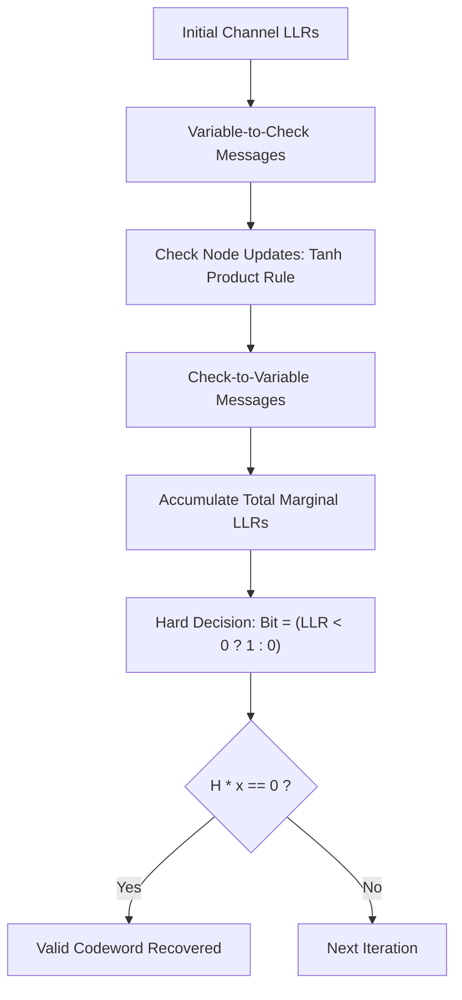

# genpark-ldpc-tanner-graph-belief-propagation-skill

Agent Skill implementing **Low-Density Parity-Check (LDPC) Tanner Graph Belief Propagation**, using iterative sum-product Log-Likelihood Ratio (LLR) message passing between variable and check nodes.

## Architectural Overview

